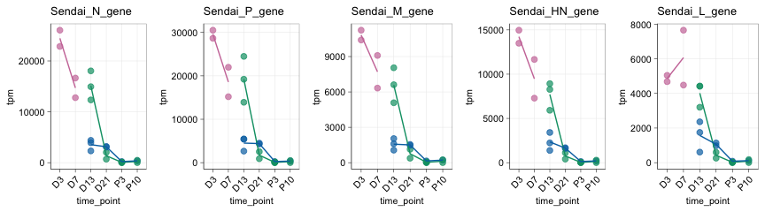
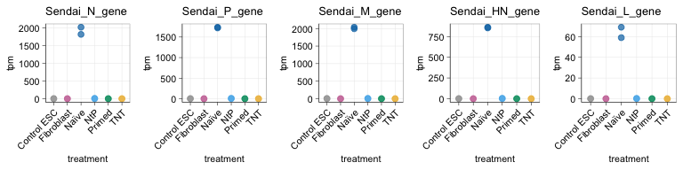
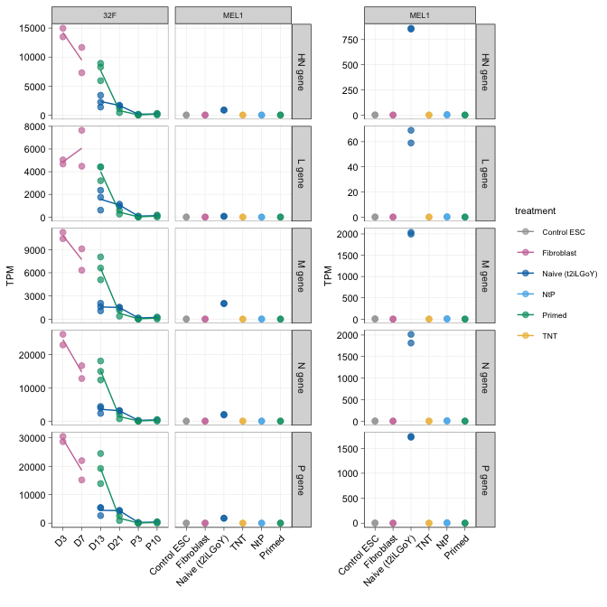

Re-analysis of De Los Angeles et al. (2024) bioRxiv TPM data
================
Sam Buckberry
2024-07-09

### Data acquistion from De Los Angeles et al.

Analysis code and data from De Los Angeles et al. was made available to
us through GitHub and Synapse (data repository)

<https://github.com/labsyspharm/tnt-rebuttal>  
<https://www.synapse.org/#!Synapse:syn53061839/files/>

For the re-analysis below, we downloaded the following files:  
`biosample_meta.csv`  
`salmon_tpm.csv.gz`

and saved them to the directory `dla-data`.

### Re-analysis of gene expression estimates generated by De Los Angeles et al. 

First, let’s plot timecourse of reprogramming for Sendai expression for
samples shown in Buckberry *et al.* (2023) *Nature*. Here, we are only
including the samples analysed in our paper (Donor 32F) as these are the
ones we used in developing the TNT hypothesis, and only used the t2iLGoY
naive media throughout our paper. This also allows us to simplify the
data visualisation to make our point, and only plot together samples
from the same experimental setup and design.

<details>
<summary>
Click to expand/collapse the code
</summary>

``` r
## Source the packages and functions we use in this analysis
source("project-functions.R")

## Load the RNA-seq quant data generated by De Los Angeles et al 
sample_meta <- read.csv("dla-data/biosample_meta.csv")
salmon_quants <- read.csv("dla-data/salmon_tpm.csv.gz")

##Subset data for Sendai genes
sev_ind <- str_starts(salmon_quants$transcript_id, fixed("Sendai"))
salmon_quants <- salmon_quants[sev_ind, ]

## Join the metadata with the quant data
ind <- match(salmon_quants$sample_accession, sample_meta$sample_accession)

sev_dat <- cbind(salmon_quants, sample_meta[ind, ])
sev_dat <- sev_dat[sev_dat$transcript_id != "Sendai_F_gene", -8]

liu_dat <- sev_dat[sev_dat$study_name %in% 
                         c("Liu Nature 2020", "Liu Nat Met 2017"), ]
liu_dat <- liu_dat[liu_dat$time_point %in% 
                       c("P8", "P20 + 3", "D3", "D7", "D13", "D21", "P3", "P10"), ]

liu_dat$time_point <- factor(liu_dat$time_point,
                               levels=c("D3", "D7", "D13", "D21", "P3", "P10"))

liu_dat <- liu_dat[liu_dat$treatment %in% c("Fibroblast", "Primed", "t2iLGoY"), ]

liu_dat <- liu_dat[!((liu_dat$age == "55") & !is.na(liu_dat$age)), ]


liu_dat <- liu_dat[!is.na(liu_dat$time_point), ]

## Subset for media analysed in Buckberry et al
reprog_pal <- c(Primed="#009E73", t2iLGoY="#0072B2", Fibroblast="#CC79A7",
                TNT="#EEBC4C", NtP="#55B3EA", "#5B7876", "#AFB4B7")

plot_sendai_timecourse <- function(transcript_id, legend_pos = "none"){
    
    gg <- ggplot(data = liu_dat[liu_dat$transcript_id == transcript_id, ],
                 mapping = aes(x = time_point, y = tpm,
                               group=treatment, colour=treatment, fill=treatment)) +
        geom_point(size=2, alpha=0.7) + 
        stat_summary(geom = "line") +
        ggtitle(transcript_id) +
        sams_pub_theme(legend_pos = legend_pos) +
        scale_color_manual(values = reprog_pal[c("Fibroblast", "t2iLGoY", "Primed")])
    gg    
}

gg_timecourse <- lapply(X = unique(liu_dat$transcript_id), FUN = plot_sendai_timecourse)
fig_2a <- cowplot::plot_grid(plotlist = gg_timecourse, nrow = 1)
```

</details>

``` r
fig_2a
```

<!-- -->

We can see in the figure above that there is a significant drop in
Sendai virus expression from day 3 of reprogramming. Notably, the
largest difference between Sendai gene expression for primed and naive
reprogramming occurs at day 13, with ~2-fold less Sendai virus in naive
media. This is a noteworthy observation, as TNT reprogramming
transitions the cells from naive media to primed media at the day 13
time point, and challenges the speculation that Sendai virus persistence
impacts TNT reprogramming.

Now let’s plot Sendai virus expression for MEL1 isogenic reprogramming
experiments. Note that this is the only experiment set from Buckberry
*et al.* (2023) *Nature* where we performed RNA-seq on TNT-iPS cells.

<details>
<summary>
Click to expand/collapse the code
</summary>

``` r
mel1_dat <- sev_dat[sev_dat$background %in% c("MEL1"), ]
mel1_dat <- mel1_dat[!is.na(mel1_dat$transcript_id), ]

reprog_pal2 <- c(TNT="#eebc4cff", Primed="#009e73ff",
                 NtP="#55b3eaff", "Control ESC" ="#a3a3a3ff",
                 Naïve="#0072b2ff", Fibroblast="#cc79a7ff")

plot_sendai_endpoint <- function(transcript_id, legend_pos = "none"){
    
    gg <- ggplot(data = mel1_dat[mel1_dat$transcript_id == transcript_id, ],
                 mapping = aes(x = treatment, y = tpm,
                               group=treatment, colour=treatment, fill=treatment)) +
        geom_point(size=2, alpha=0.7) + 
        ggtitle(transcript_id) +
        sams_pub_theme(legend_pos = legend_pos) +
        scale_colour_manual(values = reprog_pal2)
    gg    
    
}

gg_mel1 <- lapply(X = unique(mel1_dat$transcript_id), FUN = plot_sendai_endpoint)

fig_2b <- cowplot::plot_grid(plotlist = gg_mel1, nrow = 1)
```

</details>

``` r
fig_2b
```

<!-- -->

We can clearly see in the plot above that Sendai virus expression in
Naive-iPS cells is far higher than any other sample.

Now let’s plot these two experiment sets these together on the same
scale, and then the MEL1 isogenic reprogramming experiments on their own
scale so we have a comprehensive picture of the range of Sendai
expression across these two experiment sets.

<details>
<summary>
Click to expand/collapse the code
</summary>

``` r
## Set-up some clear labels
plot_dat <- rbind(liu_dat, mel1_dat)
plot_dat$group <- ifelse(plot_dat$background == "MEL1", yes = "MEL1", no = "32F")
plot_dat$group[is.na(plot_dat$group)] <- "32F"

plot_dat$id <- NA
plot_dat$id[plot_dat$group == "MEL1"] <- plot_dat$treatment[plot_dat$group == "MEL1"]
plot_dat$id[plot_dat$group == "32F"] <- as.character(plot_dat$time_point[plot_dat$group == "32F"])

plot_dat$treatment[plot_dat$treatment == "Naïve"] <- "Naive (t2iLGoY)"
plot_dat$treatment[plot_dat$treatment == "t2iLGoY"] <- "Naive (t2iLGoY)"
plot_dat$treatment[plot_dat$treatment == "t2iLGoY"] <- "Naive (t2iLGoY)"

plot_dat$id[plot_dat$id == "Naïve"] <- "Naive (t2iLGoY)"

plot_dat$id <- factor(plot_dat$id, levels = c("D3", "D7", "D13", "D21", "P3", "P10",
                                              "Control ESC", "Fibroblast", 
                                              "Naive (t2iLGoY)", "TNT", "NtP", "Primed"))

reprog_pal <- c(Primed="#009E73", "Naive (t2iLGoY)"="#0072B2", Fibroblast="#CC79A7",
                TNT="#EEBC4C", NtP="#55B3EA", "Control ESC" ="#a3a3a3ff")

plot_dat$transcript_id <- str_replace(plot_dat$transcript_id, pattern = "Sendai_", "") %>%
    str_replace(pattern = "_", " ")

sams_pub_theme2 <- function(legend_pos = "none", x.text.angle = 45, hjust = 1,
                           y.text.angle = 0, line_point = 0.5) {
    line_mm <- line_point / 2.835
    custom_theme <- theme_bw() +
        theme(plot.background = element_blank(),
              panel.grid.minor = element_blank(),
              panel.grid.major = element_line(size = line_mm),
              panel.border = element_rect(color = "black", size = line_mm, fill = NA), # Add border around each facet
              axis.text.x = element_text(angle = x.text.angle, hjust = hjust, size = 8, colour = 'black'),
              axis.text.y = element_text(size = 8, colour = 'black', angle = y.text.angle),
              strip.text.y = element_text(size = 8),
              text = element_text(size = 8),
              #strip.background = element_blank(),
              legend.position = legend_pos,
              axis.line.x = element_line(color = 'black', size = line_mm),
              axis.line.y = element_line(color = 'black', size = line_mm),
              axis.ticks = element_line(color = 'black', size = line_mm))
    return(custom_theme)
}


gg <- ggplot(data = plot_dat, mapping = aes(x = id, y = tpm,
                           group=treatment, colour=treatment, fill=treatment)) +
    geom_point(size=2, alpha=0.7) + 
    stat_summary(geom = "line") +
    facet_grid(transcript_id~group, space = "free_x", drop = TRUE, scales = "free") +
    sams_pub_theme2(legend_pos = "none") +
    xlab(label = "") + ylab("TPM") +
    scale_colour_manual(values = reprog_pal)

gg_mel1 <- ggplot(data = plot_dat[plot_dat$group == "MEL1", ],
                  mapping = aes(x = id, y = tpm,
                           group=treatment, colour=treatment, fill=treatment)) +
    geom_point(size=2, alpha=0.7) + 
    stat_summary(geom = "line") +
    facet_grid(transcript_id~group, space = "free_x", drop = TRUE, scales = "free") +
    sams_pub_theme2(legend_pos = "right") +
    xlab(label = "") + ylab("TPM") +
    scale_colour_manual(values = reprog_pal)

pdf("de-los-angeles-tpm-replot.pdf", width = 7, height = 7)
cowplot::plot_grid(gg, gg_mel1, align = "h", rel_widths = c(0.55, 0.5))
dev.off()
```

    FALSE quartz_off_screen 
    FALSE                 2

``` r
fig_2ab <- cowplot::plot_grid(gg, gg_mel1, align = "h", rel_widths = c(0.55, 0.5))
```

</details>

``` r
fig_2ab
```

<!-- -->

Although not visible in these plots, there is some very low-level
detection of Sendai virus RNA-seq reads in samples that are not
Naive-iPS cells for the MEL1 isogenic reprogramming system, and De Los
Angeles et al. base their case on these findings. To transparently show
the Sendai expression levels for these samples, we will create a table
with all the details.

<details>
<summary>
Click to expand/collapse the code
</summary>

``` r
mel1_dat <- plot_dat[plot_dat$group == "MEL1", c("transcript_id", "time_point",
                                                  "sample_accession",
                                                  "count", "tpm", "title",
                                                  "treatment")]

# Data transformation
df <- mel1_dat %>%
  mutate(combined = paste(treatment, sample_accession, sep = "_")) 

# Pivot the data to wide format
wide_df <- df %>%
  tidyr::pivot_wider(names_from = transcript_id, values_from = tpm, id_cols = c(treatment, sample_accession))

wide_df <- wide_df[order(wide_df$treatment), ]

wide_df <- wide_df %>%
  mutate(across(where(is.numeric), round, digits=2))

colnames(wide_df) <- str_remove(colnames(wide_df), "Sendai_") %>% str_remove(pattern = "sample_")

colnames(wide_df)[1] <- "Group"

wide_df$Group <- str_remove(wide_df$Group, "Control ")

colnames(wide_df) <- str_replace_all(string = colnames(wide_df), pattern = "_", replacement = " ")

table_1 <- knitr::kable(wide_df, booktabs = TRUE, latex_options = "scale_down") %>%
  kableExtra::kable_styling() %>%
  kableExtra::add_header_above(header = c(" " = 2, "Sendai gene expression (TPM)" = ncol(wide_df) - 2)) %>%
    kableExtra::add_footnote(notation = "symbol",
                             label = "TPM estimates generated by De Los Angeles et al. Original data from Buckberry et al. (2023) Nature")
```

</details>

``` r
table_1
```

<table class="table" style="color: black; margin-left: auto; margin-right: auto;">
<thead>
<tr>
<th style="empty-cells: hide;border-bottom:hidden;" colspan="2">
</th>
<th style="border-bottom:hidden;padding-bottom:0; padding-left:3px;padding-right:3px;text-align: center; " colspan="5">

<div style="border-bottom: 1px solid #ddd; padding-bottom: 5px; ">

Sendai gene expression (TPM)

</div>

</th>
</tr>
<tr>
<th style="text-align:left;">
Group
</th>
<th style="text-align:left;">
accession
</th>
<th style="text-align:right;">
N gene
</th>
<th style="text-align:right;">
P gene
</th>
<th style="text-align:right;">
M gene
</th>
<th style="text-align:right;">
HN gene
</th>
<th style="text-align:right;">
L gene
</th>
</tr>
</thead>
<tbody>
<tr>
<td style="text-align:left;">
ESC
</td>
<td style="text-align:left;">
SRS7483408
</td>
<td style="text-align:right;">
3.68
</td>
<td style="text-align:right;">
3.12
</td>
<td style="text-align:right;">
7.68
</td>
<td style="text-align:right;">
1.49
</td>
<td style="text-align:right;">
0.07
</td>
</tr>
<tr>
<td style="text-align:left;">
ESC
</td>
<td style="text-align:left;">
SRS7483409
</td>
<td style="text-align:right;">
0.13
</td>
<td style="text-align:right;">
0.13
</td>
<td style="text-align:right;">
0.16
</td>
<td style="text-align:right;">
0.04
</td>
<td style="text-align:right;">
0.00
</td>
</tr>
<tr>
<td style="text-align:left;">
Fibroblast
</td>
<td style="text-align:left;">
SRS7483415
</td>
<td style="text-align:right;">
0.00
</td>
<td style="text-align:right;">
0.01
</td>
<td style="text-align:right;">
0.00
</td>
<td style="text-align:right;">
0.00
</td>
<td style="text-align:right;">
0.00
</td>
</tr>
<tr>
<td style="text-align:left;">
Fibroblast
</td>
<td style="text-align:left;">
SRS7483416
</td>
<td style="text-align:right;">
0.00
</td>
<td style="text-align:right;">
0.00
</td>
<td style="text-align:right;">
0.00
</td>
<td style="text-align:right;">
0.00
</td>
<td style="text-align:right;">
0.00
</td>
</tr>
<tr>
<td style="text-align:left;">
Naive (t2iLGoY)
</td>
<td style="text-align:left;">
SRS7483410
</td>
<td style="text-align:right;">
2015.97
</td>
<td style="text-align:right;">
1721.58
</td>
<td style="text-align:right;">
2037.59
</td>
<td style="text-align:right;">
854.11
</td>
<td style="text-align:right;">
59.00
</td>
</tr>
<tr>
<td style="text-align:left;">
Naive (t2iLGoY)
</td>
<td style="text-align:left;">
SRS7483419
</td>
<td style="text-align:right;">
1814.79
</td>
<td style="text-align:right;">
1738.99
</td>
<td style="text-align:right;">
1994.46
</td>
<td style="text-align:right;">
862.47
</td>
<td style="text-align:right;">
69.09
</td>
</tr>
<tr>
<td style="text-align:left;">
NtP
</td>
<td style="text-align:left;">
SRS7483417
</td>
<td style="text-align:right;">
0.00
</td>
<td style="text-align:right;">
0.00
</td>
<td style="text-align:right;">
0.00
</td>
<td style="text-align:right;">
0.00
</td>
<td style="text-align:right;">
0.00
</td>
</tr>
<tr>
<td style="text-align:left;">
NtP
</td>
<td style="text-align:left;">
SRS7483418
</td>
<td style="text-align:right;">
11.52
</td>
<td style="text-align:right;">
10.72
</td>
<td style="text-align:right;">
10.78
</td>
<td style="text-align:right;">
5.64
</td>
<td style="text-align:right;">
0.33
</td>
</tr>
<tr>
<td style="text-align:left;">
Primed
</td>
<td style="text-align:left;">
SRS7483411
</td>
<td style="text-align:right;">
0.54
</td>
<td style="text-align:right;">
0.43
</td>
<td style="text-align:right;">
0.66
</td>
<td style="text-align:right;">
0.14
</td>
<td style="text-align:right;">
0.01
</td>
</tr>
<tr>
<td style="text-align:left;">
Primed
</td>
<td style="text-align:left;">
SRS7483412
</td>
<td style="text-align:right;">
0.00
</td>
<td style="text-align:right;">
0.00
</td>
<td style="text-align:right;">
0.00
</td>
<td style="text-align:right;">
0.00
</td>
<td style="text-align:right;">
0.00
</td>
</tr>
<tr>
<td style="text-align:left;">
TNT
</td>
<td style="text-align:left;">
SRS7483413
</td>
<td style="text-align:right;">
0.00
</td>
<td style="text-align:right;">
0.00
</td>
<td style="text-align:right;">
0.00
</td>
<td style="text-align:right;">
0.00
</td>
<td style="text-align:right;">
0.00
</td>
</tr>
<tr>
<td style="text-align:left;">
TNT
</td>
<td style="text-align:left;">
SRS7483414
</td>
<td style="text-align:right;">
0.00
</td>
<td style="text-align:right;">
0.00
</td>
<td style="text-align:right;">
0.00
</td>
<td style="text-align:right;">
0.00
</td>
<td style="text-align:right;">
0.00
</td>
</tr>
</tbody>
<tfoot>
<tr>
<td style="padding: 0; border:0;" colspan="100%">
<sup>\*</sup> TPM estimates generated by De Los Angeles et al. Original
data from Buckberry et al. (2023) Nature
</td>
</tr>
</tfoot>
</table>

In the table above, we can see that there is some-low level read counts
in both ESC, one NtP, and one Primed line and none in TNT-iPS cells.

Of note, there is considerable difference in the TPM values for each
Sendai gene, thus it was probably inappropriate for De Los Angeles et
al. to be simply averaging expression across all Sendai genes for their
Fig 1b plot.

However, the detection of Sendai virus in ESC samples warrants further
investigation, which we will address in subsequent analyses.

### Session info

<details>
<summary>
Click to expand/collapse the code
</summary>

``` r
sessionInfo()
```

    ## R version 4.4.0 (2024-04-24)
    ## Platform: aarch64-apple-darwin20
    ## Running under: macOS Sonoma 14.5
    ## 
    ## Matrix products: default
    ## BLAS:   /Library/Frameworks/R.framework/Versions/4.4-arm64/Resources/lib/libRblas.0.dylib 
    ## LAPACK: /Library/Frameworks/R.framework/Versions/4.4-arm64/Resources/lib/libRlapack.dylib;  LAPACK version 3.12.0
    ## 
    ## locale:
    ## [1] en_US.UTF-8/en_US.UTF-8/en_US.UTF-8/C/en_US.UTF-8/en_US.UTF-8
    ## 
    ## time zone: Australia/Perth
    ## tzcode source: internal
    ## 
    ## attached base packages:
    ## [1] grid      stats4    stats     graphics  grDevices utils     datasets 
    ## [8] methods   base     
    ## 
    ## other attached packages:
    ##  [1] forcats_1.0.0          readxl_1.4.3           data.table_1.15.4     
    ##  [4] dplyr_1.1.4            plotly_4.10.4          rtracklayer_1.64.0    
    ##  [7] Gviz_1.48.0            Rsamtools_2.20.0       Biostrings_2.72.1     
    ## [10] XVector_0.44.0         cowplot_1.1.3          gridExtra_2.3         
    ## [13] reshape2_1.4.4         stringr_1.5.1          GenomicFeatures_1.56.0
    ## [16] AnnotationDbi_1.66.0   Biobase_2.64.0         GenomicRanges_1.56.0  
    ## [19] GenomeInfoDb_1.40.0    IRanges_2.38.0         S4Vectors_0.42.0      
    ## [22] BiocGenerics_0.50.0    ggplot2_3.5.1          magrittr_2.0.3        
    ## [25] edgeR_4.2.0            limma_3.60.2          
    ## 
    ## loaded via a namespace (and not attached):
    ##   [1] RColorBrewer_1.1-3          rstudioapi_0.16.0          
    ##   [3] jsonlite_1.8.8              farver_2.1.2               
    ##   [5] rmarkdown_2.27              BiocIO_1.14.0              
    ##   [7] zlibbioc_1.50.0             vctrs_0.6.5                
    ##   [9] memoise_2.0.1               RCurl_1.98-1.14            
    ##  [11] base64enc_0.1-3             htmltools_0.5.8.1          
    ##  [13] S4Arrays_1.4.1              progress_1.2.3             
    ##  [15] curl_5.2.1                  cellranger_1.1.0           
    ##  [17] SparseArray_1.4.8           Formula_1.2-5              
    ##  [19] htmlwidgets_1.6.4           plyr_1.8.9                 
    ##  [21] httr2_1.0.1                 cachem_1.1.0               
    ##  [23] GenomicAlignments_1.40.0    lifecycle_1.0.4            
    ##  [25] pkgconfig_2.0.3             Matrix_1.7-0               
    ##  [27] R6_2.5.1                    fastmap_1.2.0              
    ##  [29] GenomeInfoDbData_1.2.12     MatrixGenerics_1.16.0      
    ##  [31] digest_0.6.35               colorspace_2.1-0           
    ##  [33] Hmisc_5.1-3                 RSQLite_2.3.7              
    ##  [35] labeling_0.4.3              filelock_1.0.3             
    ##  [37] fansi_1.0.6                 httr_1.4.7                 
    ##  [39] abind_1.4-5                 compiler_4.4.0             
    ##  [41] bit64_4.0.5                 withr_3.0.0                
    ##  [43] htmlTable_2.4.2             backports_1.5.0            
    ##  [45] BiocParallel_1.38.0         DBI_1.2.3                  
    ##  [47] highr_0.11                  biomaRt_2.60.0             
    ##  [49] rappdirs_0.3.3              DelayedArray_0.30.1        
    ##  [51] rjson_0.2.21                tools_4.4.0                
    ##  [53] foreign_0.8-86              nnet_7.3-19                
    ##  [55] glue_1.7.0                  restfulr_0.0.15            
    ##  [57] checkmate_2.3.1             cluster_2.1.6              
    ##  [59] generics_0.1.3              gtable_0.3.5               
    ##  [61] BSgenome_1.72.0             tidyr_1.3.1                
    ##  [63] ensembldb_2.28.0            hms_1.1.3                  
    ##  [65] xml2_1.3.6                  utf8_1.2.4                 
    ##  [67] pillar_1.9.0                BiocFileCache_2.12.0       
    ##  [69] lattice_0.22-6              deldir_2.0-4               
    ##  [71] bit_4.0.5                   biovizBase_1.52.0          
    ##  [73] tidyselect_1.2.1            locfit_1.5-9.9             
    ##  [75] knitr_1.47                  ProtGenerics_1.36.0        
    ##  [77] SummarizedExperiment_1.34.0 svglite_2.1.3              
    ##  [79] xfun_0.44                   statmod_1.5.0              
    ##  [81] matrixStats_1.3.0           stringi_1.8.4              
    ##  [83] UCSC.utils_1.0.0            lazyeval_0.2.2             
    ##  [85] yaml_2.3.8                  kableExtra_1.4.0           
    ##  [87] evaluate_0.23               codetools_0.2-20           
    ##  [89] interp_1.1-6                tibble_3.2.1               
    ##  [91] cli_3.6.2                   rpart_4.1.23               
    ##  [93] systemfonts_1.1.0           munsell_0.5.1              
    ##  [95] dichromat_2.0-0.1           Rcpp_1.0.12                
    ##  [97] dbplyr_2.5.0                png_0.1-8                  
    ##  [99] XML_3.99-0.16.1             parallel_4.4.0             
    ## [101] blob_1.2.4                  prettyunits_1.2.0          
    ## [103] latticeExtra_0.6-30         jpeg_0.1-10                
    ## [105] AnnotationFilter_1.28.0     bitops_1.0-7               
    ## [107] viridisLite_0.4.2           VariantAnnotation_1.50.0   
    ## [109] scales_1.3.0                purrr_1.0.2                
    ## [111] crayon_1.5.2                rlang_1.1.4                
    ## [113] KEGGREST_1.44.0

</details>
