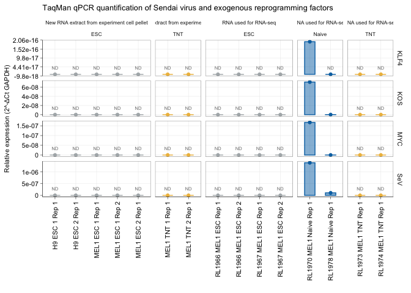

Sendai TaqMan qPCR analysis
================
Sam Buckberry
2024-07-09

``` r
source("project-functions.R")
# Load the readxl library
# Load the modified dataset from the new Excel file
data <- read_excel("pcr-data/TaqMan_assays.xlsx")

# Replace spaces in column names with underscores
colnames(data) <- gsub(" ", "", colnames(data))

data <- reshape2::melt(data)

# Replace NA values in numeric columns with 'ND'
data <- data %>%
  mutate(across(where(is.numeric), ~ifelse(is.na(.), "ND", .)))

data$RNA_origin <- ifelse(test = startsWith(as.character(data$variable), "RL"),
                     yes = "RNA used for RNA-seq",
                     no = "New RNA extract from experiment cell pellet")

# Convert data values for 'ND' into numeric NA for plotting purposes
data$value <- as.numeric(as.character(data$value))

# Replace NA back with 'ND' for annotation on the plot
data$value_label <- ifelse(is.na(data$value), "ND", "")

# Add a grouping column based on the sample names
data$Group <- case_when(
  grepl("ESC", data$variable) ~ "ESC",
  grepl("TNT", data$variable) ~ "TNT",
  grepl("naive", data$variable) ~ "Naive",
  grepl("primed", data$variable) ~ "Primed",
  TRUE ~ "Other"  # This catches any samples not fitting the above categories
)

data <- data %>%
  mutate(Group_key = case_when(
    Group == "ESC" ~ 1,
    Group == "TNT" ~ 2,
    Group == "Naive" ~ 3,
    Group == "Primed" ~ 4,
    TRUE ~ 5
  )) %>%
  arrange(Group_key, variable) %>%
  mutate(variable = fct_inorder(variable))

# Create separate data frames for each type of plot based on 'Method'
ct_data <- data %>% filter(Method == "CT values")
delta_ct_data <- data %>% filter(Method == "ΔCT")
two_neg_delta_ct_data <- data %>% filter(Method == "2^-ΔCt")

## Add zero's for not detected. 
two_neg_delta_ct_data$value[two_neg_delta_ct_data$value_label == "ND"] <- 0 


## We assayed extra samples from the freezer to be sure, but will subset here to only plot samples for Buckberry et al. (2023) Nature for clarity

remove_samples <- c("RL1956_38F_primed", "RL1965_38F_naive")


two_neg_delta_ct_data <- two_neg_delta_ct_data[!two_neg_delta_ct_data$variable %in% remove_samples, ]

## Clean up the labels and make consistent
two_neg_delta_ct_data$variable <- str_replace_all(two_neg_delta_ct_data$variable,
                                              pattern = "Mel1", replacement = "MEL1") %>%
    #str_replace("_1", " Rep 1") %>% str_replace("_2", " Rep 2") %>%
    #str_replace("r1", " Rep 1") %>% str_replace("r2", " Rep 2") %>% 
    str_replace("naive", "Naive") %>% str_replace("r1", "Rep 1") %>% str_replace("r2", "Rep 2") %>% str_replace("RL1974_TNT", "RL1974_Mel1_TNT") %>%
    str_replace("Mel1", "MEL1") %>% str_replace_all("_", " ")


## Add rep
no_rep <- !grepl(pattern = "Rep", x = two_neg_delta_ct_data$variable)

two_neg_delta_ct_data$variable[no_rep] <- str_c(two_neg_delta_ct_data$variable[no_rep],
                                                " Rep 1")


label_sigfig <- function(x) {
  signif(x, 3)
}

gg <- ggplot(two_neg_delta_ct_data,
       aes(x = variable, y = value, fill = Group, colour = Group)) +
    geom_col(position = "dodge", width = 0.5, alpha=0.5) +
    geom_point() +
    scale_colour_manual(values = c(TNT="#EEBC4C", Naive = "#0072B2", ESC = "#AFB4B7")) +
    scale_fill_manual(values = c(TNT="#EEBC4C", Naive = "#0072B2", ESC = "#AFB4B7")) +
    scale_y_continuous(labels = label_sigfig) +
    facet_grid(Gene~RNA_origin+Group, scales = "free",space = "free_x",  drop = TRUE) +
    labs(x = "", y = "Relative expression (2^-ΔCt GAPDH)") +
    sams_pub_theme() +
    theme(axis.text.x = element_text(angle = 90, hjust = 1, vjust = 0.5),
          legend.title = element_blank()) + # Remove legend title
    geom_text(aes(label = value_label, colour="black", fill="black"), vjust = -1.5,
              position = position_dodge(width = 0.9), size=2) +
    ggtitle("TaqMan qPCR quantification of Sendai virus and exogenous reprogramming factors")


gg
```

<!-- -->

``` r
sessionInfo()
```

    ## R version 4.4.0 (2024-04-24)
    ## Platform: aarch64-apple-darwin20
    ## Running under: macOS Sonoma 14.5
    ## 
    ## Matrix products: default
    ## BLAS:   /Library/Frameworks/R.framework/Versions/4.4-arm64/Resources/lib/libRblas.0.dylib 
    ## LAPACK: /Library/Frameworks/R.framework/Versions/4.4-arm64/Resources/lib/libRlapack.dylib;  LAPACK version 3.12.0
    ## 
    ## locale:
    ## [1] en_US.UTF-8/en_US.UTF-8/en_US.UTF-8/C/en_US.UTF-8/en_US.UTF-8
    ## 
    ## time zone: Australia/Perth
    ## tzcode source: internal
    ## 
    ## attached base packages:
    ## [1] grid      stats4    stats     graphics  grDevices utils     datasets 
    ## [8] methods   base     
    ## 
    ## other attached packages:
    ##  [1] forcats_1.0.0          readxl_1.4.3           data.table_1.15.4     
    ##  [4] dplyr_1.1.4            plotly_4.10.4          rtracklayer_1.64.0    
    ##  [7] Gviz_1.48.0            Rsamtools_2.20.0       Biostrings_2.72.1     
    ## [10] XVector_0.44.0         cowplot_1.1.3          gridExtra_2.3         
    ## [13] reshape2_1.4.4         stringr_1.5.1          GenomicFeatures_1.56.0
    ## [16] AnnotationDbi_1.66.0   Biobase_2.64.0         GenomicRanges_1.56.0  
    ## [19] GenomeInfoDb_1.40.0    IRanges_2.38.0         S4Vectors_0.42.0      
    ## [22] BiocGenerics_0.50.0    ggplot2_3.5.1          magrittr_2.0.3        
    ## [25] edgeR_4.2.0            limma_3.60.2          
    ## 
    ## loaded via a namespace (and not attached):
    ##   [1] RColorBrewer_1.1-3          rstudioapi_0.16.0          
    ##   [3] jsonlite_1.8.8              farver_2.1.2               
    ##   [5] rmarkdown_2.27              BiocIO_1.14.0              
    ##   [7] zlibbioc_1.50.0             vctrs_0.6.5                
    ##   [9] memoise_2.0.1               RCurl_1.98-1.14            
    ##  [11] base64enc_0.1-3             htmltools_0.5.8.1          
    ##  [13] S4Arrays_1.4.1              progress_1.2.3             
    ##  [15] curl_5.2.1                  cellranger_1.1.0           
    ##  [17] SparseArray_1.4.8           Formula_1.2-5              
    ##  [19] htmlwidgets_1.6.4           plyr_1.8.9                 
    ##  [21] httr2_1.0.1                 cachem_1.1.0               
    ##  [23] GenomicAlignments_1.40.0    lifecycle_1.0.4            
    ##  [25] pkgconfig_2.0.3             Matrix_1.7-0               
    ##  [27] R6_2.5.1                    fastmap_1.2.0              
    ##  [29] GenomeInfoDbData_1.2.12     MatrixGenerics_1.16.0      
    ##  [31] digest_0.6.35               colorspace_2.1-0           
    ##  [33] Hmisc_5.1-3                 RSQLite_2.3.7              
    ##  [35] labeling_0.4.3              filelock_1.0.3             
    ##  [37] fansi_1.0.6                 httr_1.4.7                 
    ##  [39] abind_1.4-5                 compiler_4.4.0             
    ##  [41] bit64_4.0.5                 withr_3.0.0                
    ##  [43] htmlTable_2.4.2             backports_1.5.0            
    ##  [45] BiocParallel_1.38.0         DBI_1.2.3                  
    ##  [47] highr_0.11                  biomaRt_2.60.0             
    ##  [49] rappdirs_0.3.3              DelayedArray_0.30.1        
    ##  [51] rjson_0.2.21                tools_4.4.0                
    ##  [53] foreign_0.8-86              nnet_7.3-19                
    ##  [55] glue_1.7.0                  restfulr_0.0.15            
    ##  [57] checkmate_2.3.1             cluster_2.1.6              
    ##  [59] generics_0.1.3              gtable_0.3.5               
    ##  [61] BSgenome_1.72.0             tidyr_1.3.1                
    ##  [63] ensembldb_2.28.0            hms_1.1.3                  
    ##  [65] xml2_1.3.6                  utf8_1.2.4                 
    ##  [67] pillar_1.9.0                BiocFileCache_2.12.0       
    ##  [69] lattice_0.22-6              deldir_2.0-4               
    ##  [71] bit_4.0.5                   biovizBase_1.52.0          
    ##  [73] tidyselect_1.2.1            locfit_1.5-9.9             
    ##  [75] knitr_1.47                  ProtGenerics_1.36.0        
    ##  [77] SummarizedExperiment_1.34.0 xfun_0.44                  
    ##  [79] statmod_1.5.0               matrixStats_1.3.0          
    ##  [81] stringi_1.8.4               UCSC.utils_1.0.0           
    ##  [83] lazyeval_0.2.2              yaml_2.3.8                 
    ##  [85] evaluate_0.23               codetools_0.2-20           
    ##  [87] interp_1.1-6                tibble_3.2.1               
    ##  [89] cli_3.6.2                   rpart_4.1.23               
    ##  [91] munsell_0.5.1               dichromat_2.0-0.1          
    ##  [93] Rcpp_1.0.12                 dbplyr_2.5.0               
    ##  [95] png_0.1-8                   XML_3.99-0.16.1            
    ##  [97] parallel_4.4.0              blob_1.2.4                 
    ##  [99] prettyunits_1.2.0           latticeExtra_0.6-30        
    ## [101] jpeg_0.1-10                 AnnotationFilter_1.28.0    
    ## [103] bitops_1.0-7                viridisLite_0.4.2          
    ## [105] VariantAnnotation_1.50.0    scales_1.3.0               
    ## [107] purrr_1.0.2                 crayon_1.5.2               
    ## [109] rlang_1.1.4                 KEGGREST_1.44.0
