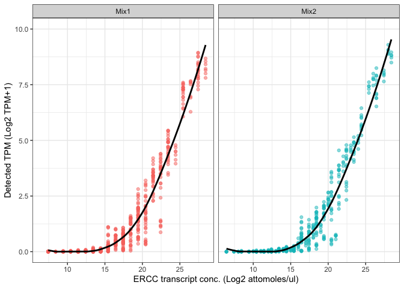
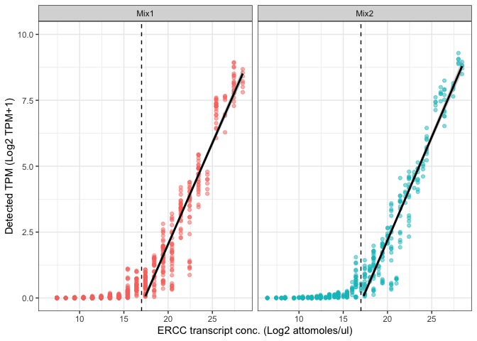
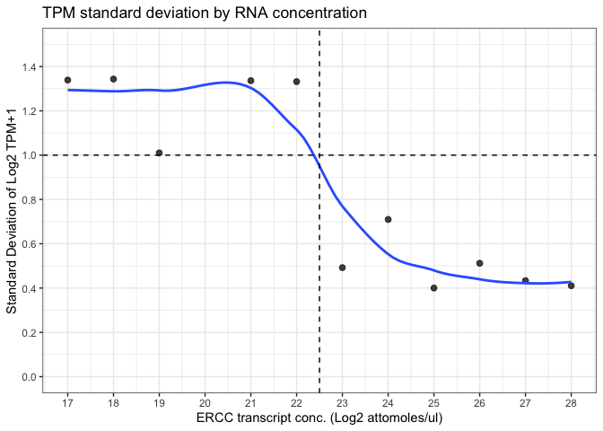
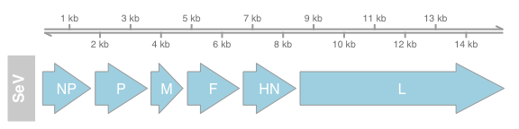
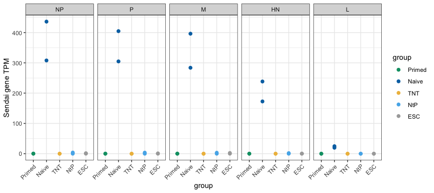
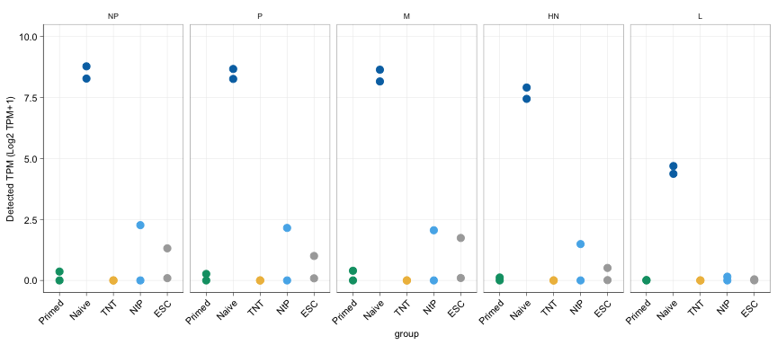
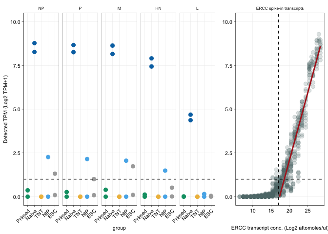

RNA-seq re-analysis: MEL1 reprogramming system
================
Sam Buckberry
2024-07-09

## Background

De Los Angeles et al. state “Surprisingly, control MEL1 hESC samples
from Buckberry et al. also had low but detectable levels of Sendai
expression” and “hESCs were not deliberately infected with Sendai
viruses, suggesting a contamination or possibly a mix-up of hESC and TNT
hiPSC samples.”

Presented here is a re-analysis of the RNA-seq data from the MEL1
isogenic control experiments from Buckberry et al. (Figure 4).

The aim of this study is to evalulate the detection and quantificaiton
of Sendai virus (SeV) genes in MEL1 ESC, fibroblast, primed, NtP and TNT
samples.

## Methods

### polyA RNA-seq (as reported in Buckberry et al. 2023 Nature)

RNA was extracted using the Agencourt RNAdvance Cell v2 (Beckman
Coulter) system following the manufacturer’s instruction with one
additional DNAse (NEB) treatment step. RNA amounts and RINe scores were
assessed on a TapeStation using RNA Screen Tape (Agilent), and 500 ng of
total RNA were used per sample to generate RNA-seq libraries. **ERCC
ExFold RNA Spike-In mixes (Thermo Scientific) were added as internal
controls**. Libraries were prepared using the TruSeq Stranded mRNA
library prep kit (Illumina), using TruSeq RNA unique dual index adapters
(Illumina). Libraries were quantified by qPCR on a CFX96/C1000 cycler
(Bio-Rad), **multiplexed and sequenced on a NovaSeq 6000 (Illumina)** in
2× 53-bp paired-end format.

### Pre-map filtering

FASTQ files were processed with `fastp` with the options
`--detect_adapter_for_pe --trim_poly_g --trim_front1 1 --trim_tail1 1 --correction`

### Reference genomes and alignment

Reference genomes GRCh38, NC_075392.1 and ERCC spike in sequences, along
with gencode v27 primary assembly annotations, transposable element
annotations, and sendai gene models were used to create a STAR alignment
index.

Reads were aligned with the STAR default options.

Post-alignment BAM files were filtered for unique alignments using
`samtools -q 255` as STAR uses the MAPQ score of 255 to mark unique
alignments. PCR duplicates were marked with `samtools markdup`.

### Expression quantification

Given the goal is *confident* virus detection, a conservative approach
has been taken to assigning reads to features. These features include
gencode genes, transposable elements, SeV genes and ERCC spike in
transcripts.

Quantification was performed with featureCounts with the options
`featureCounts -p -T 16 -s 2 --fracOverlap 0.75 --primary --ignoreDup --countReadPairs -B -C -a`.

**This conservative approach only counts reads that are \[1\] primary
alignments (actually already filtered for with unique alignments), \[2\]
not PCR or optical/exAmp duplicates, \[3\] both pairs are mapped and not
discordant, and \[4\] reads that overlap the feature being counted by at
least 75%.**

## Results

``` r
source("project-functions.R")
```

``` r
## Sample metadata
sample_dat <- data.table::fread("polyA_RNAseq_sample_table.tsv")

## RNA-seq counts data
count_dat <- read.table("mel1_rmdup.featureCounts.gz", header = TRUE)
colnames(count_dat) <- colnames(count_dat) %>%
    str_remove("X.data.tki_bodl.sammyb.") %>%
    str_remove("_Aligned.markdup.bam")

## Subset just to counts
dat <- count_dat[ ,colnames(count_dat) %in% sample_dat$Library]
rownames(dat) <- count_dat$Geneid

# Check library ID's match and order accordingly
stopifnot(all(colnames(dat) %in% sample_dat$Library))
sample_dat <- sample_dat[match(colnames(dat), sample_dat$Library), ]
stopifnot(all(sample_dat$Library == colnames(dat)))

## Load the ERCC data
ercc_metrics <- read.csv("ERCC_controls_metrics.csv")
ercc_metrics$dilution <- 1/1000
ercc_metrics$spike_vol_ul <- 4
ercc_metrics$totalRNAmass <- 0.2

## Load the sendai gene data
library(rtracklayer)
sendai <- readGFF(filepath = "NC_075392.1.gff3")
sendai_dat <- data.frame(chr=sendai$seqid, type=sendai$type, id=sendai$ID,
                         gene=sendai$gene, start=sendai$start, end=sendai$end)

# Calculate TPM
countToTpm <- function(counts, effLen){
    rate <- log(counts) - log(effLen)
    denom <- log(sum(exp(rate)))
    exp(rate - denom + log(1e6))
}

tpm <- countToTpm(counts = dat, effLen = count_dat$Length)

ercc_tpm <- tpm
ercc_tpm$ercc <- rownames(ercc_tpm)
ercc_tpm <- ercc_tpm[rownames(ercc_tpm) %in% ercc_metrics$ERCC, ]
ercc_tpm <- melt(ercc_tpm)

ercc_tpm$molecules_ul_mix1 <- ercc_metrics$molecules.ul.mix.1[match(ercc_tpm$ercc, ercc_metrics$ERCC)]
ercc_tpm$molecules_ul_mix2 <- ercc_metrics$molecules_ul_mix2[match(ercc_tpm$ercc, ercc_metrics$ERCC)]
ercc_tpm$mix <- factor(sample_dat$ERCC_Spike[match(ercc_tpm$variable, sample_dat$Library)])
ercc_tpm$conc <- ifelse(ercc_tpm$mix == "Mix1",
                        yes = ercc_tpm$molecules_ul_mix1,
                        no = ercc_tpm$molecules_ul_mix2)
ercc_tpm$transcripts <- ((ercc_tpm$conc / (1/1000))*4)/200

## Get the sendai expression data
sendai_genes <- count_dat$Geneid[count_dat$Chr ==  "NC_075392.1"]
sendai_tpm <- tpm[rownames(tpm) %in% sendai_genes, ]
sendai_tpm$id<- rownames(tpm)[rownames(tpm) %in% sendai_genes]
sendai_tpm <- reshape2::melt(sendai_tpm)
sendai_tpm$gene_id <- sendai_dat$gene[match(sendai_tpm$id, sendai_dat$id)]
sendai_tpm$group <- sample_dat$Group[match(sendai_tpm$variable, sample_dat$Library)]
sendai_tpm$gene_id <- factor(sendai_tpm$gene_id, levels=unique(sendai_dat$gene))
sendai_tpm$ercc_mix <- sample_dat$ERCC_Spike[match(sendai_tpm$variable, sample_dat$Library)]
```

#### Sample information

**Table 1:** Sample metadata.

``` r
knitr::kable(sample_dat, booktabs = TRUE, latex_options = "scale_down") %>%
  kableExtra::kable_styling()
```

<table class="table" style="color: black; margin-left: auto; margin-right: auto;">
<thead>
<tr>
<th style="text-align:left;">
Library
</th>
<th style="text-align:left;">
Group
</th>
<th style="text-align:left;">
Donor
</th>
<th style="text-align:left;">
Passage
</th>
<th style="text-align:left;">
Media
</th>
<th style="text-align:left;">
Sample
</th>
<th style="text-align:left;">
ERCC_Spike
</th>
<th style="text-align:left;">
RIN
</th>
<th style="text-align:left;">
Batch
</th>
</tr>
</thead>
<tbody>
<tr>
<td style="text-align:left;">
RL1966
</td>
<td style="text-align:left;">
ESC
</td>
<td style="text-align:left;">
MEL1
</td>
<td style="text-align:left;">
P13plus20
</td>
<td style="text-align:left;">
E8
</td>
<td style="text-align:left;">
P13 + 20 MEL1 in E8
</td>
<td style="text-align:left;">
Mix1
</td>
<td style="text-align:left;">
RINe 10
</td>
<td style="text-align:left;">
15_10_19
</td>
</tr>
<tr>
<td style="text-align:left;">
RL1967
</td>
<td style="text-align:left;">
ESC
</td>
<td style="text-align:left;">
MEL1
</td>
<td style="text-align:left;">
P13plus14
</td>
<td style="text-align:left;">
E8
</td>
<td style="text-align:left;">
P13_Plus_14_MEL1_Primed_E8
</td>
<td style="text-align:left;">
Mix1
</td>
<td style="text-align:left;">
RINe 7.5
</td>
<td style="text-align:left;">
05_09_19
</td>
</tr>
<tr>
<td style="text-align:left;">
RL1970
</td>
<td style="text-align:left;">
Naive
</td>
<td style="text-align:left;">
MEL1
</td>
<td style="text-align:left;">
P15
</td>
<td style="text-align:left;">
t2iLGoY
</td>
<td style="text-align:left;">
P15 MEL1 HDF to SR
</td>
<td style="text-align:left;">
Mix1
</td>
<td style="text-align:left;">
RINe 9.9
</td>
<td style="text-align:left;">
07_10_19
</td>
</tr>
<tr>
<td style="text-align:left;">
RL1971
</td>
<td style="text-align:left;">
Primed
</td>
<td style="text-align:left;">
MEL1
</td>
<td style="text-align:left;">
P17
</td>
<td style="text-align:left;">
E8
</td>
<td style="text-align:left;">
P17 MEL1 HDF to E8
</td>
<td style="text-align:left;">
Mix1
</td>
<td style="text-align:left;">
RINe 7.8
</td>
<td style="text-align:left;">
07_10_19
</td>
</tr>
<tr>
<td style="text-align:left;">
RL1972
</td>
<td style="text-align:left;">
Primed
</td>
<td style="text-align:left;">
MEL1
</td>
<td style="text-align:left;">
P18
</td>
<td style="text-align:left;">
E8
</td>
<td style="text-align:left;">
P18 MEL1 HDF to E8
</td>
<td style="text-align:left;">
Mix1
</td>
<td style="text-align:left;">
RINe 10
</td>
<td style="text-align:left;">
15_10_19
</td>
</tr>
<tr>
<td style="text-align:left;">
RL1973
</td>
<td style="text-align:left;">
TNT
</td>
<td style="text-align:left;">
MEL1
</td>
<td style="text-align:left;">
P17
</td>
<td style="text-align:left;">
E8
</td>
<td style="text-align:left;">
P17 MEL1 D13 TNT
</td>
<td style="text-align:left;">
Mix2
</td>
<td style="text-align:left;">
RINe 10
</td>
<td style="text-align:left;">
07_10_19
</td>
</tr>
<tr>
<td style="text-align:left;">
RL1974
</td>
<td style="text-align:left;">
TNT
</td>
<td style="text-align:left;">
MEL1
</td>
<td style="text-align:left;">
P16
</td>
<td style="text-align:left;">
E8
</td>
<td style="text-align:left;">
P16 MEL1 D13 TNT
</td>
<td style="text-align:left;">
Mix2
</td>
<td style="text-align:left;">
RINe 9.8
</td>
<td style="text-align:left;">
15_10_19
</td>
</tr>
<tr>
<td style="text-align:left;">
RL1975
</td>
<td style="text-align:left;">
Fibroblast
</td>
<td style="text-align:left;">
MEL1
</td>
<td style="text-align:left;">
P8
</td>
<td style="text-align:left;">
MEF
</td>
<td style="text-align:left;">
P8 MEL1 HDFa
</td>
<td style="text-align:left;">
Mix1
</td>
<td style="text-align:left;">
RINe 9.7
</td>
<td style="text-align:left;">
04_10_19
</td>
</tr>
<tr>
<td style="text-align:left;">
RL1976
</td>
<td style="text-align:left;">
Fibroblast
</td>
<td style="text-align:left;">
MEL1
</td>
<td style="text-align:left;">
P20plus3
</td>
<td style="text-align:left;">
MEF
</td>
<td style="text-align:left;">
P20+3 MEL1 hESCs to fibroblasts
</td>
<td style="text-align:left;">
Mix2
</td>
<td style="text-align:left;">
RINe 10
</td>
<td style="text-align:left;">
20_08_19
</td>
</tr>
<tr>
<td style="text-align:left;">
RL1977
</td>
<td style="text-align:left;">
N2P
</td>
<td style="text-align:left;">
MEL1
</td>
<td style="text-align:left;">
P4plus19
</td>
<td style="text-align:left;">
E8
</td>
<td style="text-align:left;">
P4+19 MEL1-HDFa N2P
</td>
<td style="text-align:left;">
Mix2
</td>
<td style="text-align:left;">
RINe 9.1
</td>
<td style="text-align:left;">
09_12_19
</td>
</tr>
<tr>
<td style="text-align:left;">
RL1978
</td>
<td style="text-align:left;">
N2P
</td>
<td style="text-align:left;">
MEL1
</td>
<td style="text-align:left;">
P9plus13
</td>
<td style="text-align:left;">
E8
</td>
<td style="text-align:left;">
P9+13 MEL1-HDFa N2P
</td>
<td style="text-align:left;">
Mix2
</td>
<td style="text-align:left;">
RINe 8.4
</td>
<td style="text-align:left;">
09_12_19
</td>
</tr>
<tr>
<td style="text-align:left;">
RL1979
</td>
<td style="text-align:left;">
Naive
</td>
<td style="text-align:left;">
MEL1
</td>
<td style="text-align:left;">
P15
</td>
<td style="text-align:left;">
t2iLGoY
</td>
<td style="text-align:left;">
P15 MEL1 HDF to SR
</td>
<td style="text-align:left;">
Mix1
</td>
<td style="text-align:left;">
RINe 7.5
</td>
<td style="text-align:left;">
07_10_19
</td>
</tr>
</tbody>
</table>

``` r
pdf("rna-seq-quant-ercc-table.png")
knitr::kable(sample_dat, booktabs = TRUE, latex_options = "scale_down") %>%
  kableExtra::kable_styling()
```

<table class="table" style="color: black; margin-left: auto; margin-right: auto;">
<thead>
<tr>
<th style="text-align:left;">
Library
</th>
<th style="text-align:left;">
Group
</th>
<th style="text-align:left;">
Donor
</th>
<th style="text-align:left;">
Passage
</th>
<th style="text-align:left;">
Media
</th>
<th style="text-align:left;">
Sample
</th>
<th style="text-align:left;">
ERCC_Spike
</th>
<th style="text-align:left;">
RIN
</th>
<th style="text-align:left;">
Batch
</th>
</tr>
</thead>
<tbody>
<tr>
<td style="text-align:left;">
RL1966
</td>
<td style="text-align:left;">
ESC
</td>
<td style="text-align:left;">
MEL1
</td>
<td style="text-align:left;">
P13plus20
</td>
<td style="text-align:left;">
E8
</td>
<td style="text-align:left;">
P13 + 20 MEL1 in E8
</td>
<td style="text-align:left;">
Mix1
</td>
<td style="text-align:left;">
RINe 10
</td>
<td style="text-align:left;">
15_10_19
</td>
</tr>
<tr>
<td style="text-align:left;">
RL1967
</td>
<td style="text-align:left;">
ESC
</td>
<td style="text-align:left;">
MEL1
</td>
<td style="text-align:left;">
P13plus14
</td>
<td style="text-align:left;">
E8
</td>
<td style="text-align:left;">
P13_Plus_14_MEL1_Primed_E8
</td>
<td style="text-align:left;">
Mix1
</td>
<td style="text-align:left;">
RINe 7.5
</td>
<td style="text-align:left;">
05_09_19
</td>
</tr>
<tr>
<td style="text-align:left;">
RL1970
</td>
<td style="text-align:left;">
Naive
</td>
<td style="text-align:left;">
MEL1
</td>
<td style="text-align:left;">
P15
</td>
<td style="text-align:left;">
t2iLGoY
</td>
<td style="text-align:left;">
P15 MEL1 HDF to SR
</td>
<td style="text-align:left;">
Mix1
</td>
<td style="text-align:left;">
RINe 9.9
</td>
<td style="text-align:left;">
07_10_19
</td>
</tr>
<tr>
<td style="text-align:left;">
RL1971
</td>
<td style="text-align:left;">
Primed
</td>
<td style="text-align:left;">
MEL1
</td>
<td style="text-align:left;">
P17
</td>
<td style="text-align:left;">
E8
</td>
<td style="text-align:left;">
P17 MEL1 HDF to E8
</td>
<td style="text-align:left;">
Mix1
</td>
<td style="text-align:left;">
RINe 7.8
</td>
<td style="text-align:left;">
07_10_19
</td>
</tr>
<tr>
<td style="text-align:left;">
RL1972
</td>
<td style="text-align:left;">
Primed
</td>
<td style="text-align:left;">
MEL1
</td>
<td style="text-align:left;">
P18
</td>
<td style="text-align:left;">
E8
</td>
<td style="text-align:left;">
P18 MEL1 HDF to E8
</td>
<td style="text-align:left;">
Mix1
</td>
<td style="text-align:left;">
RINe 10
</td>
<td style="text-align:left;">
15_10_19
</td>
</tr>
<tr>
<td style="text-align:left;">
RL1973
</td>
<td style="text-align:left;">
TNT
</td>
<td style="text-align:left;">
MEL1
</td>
<td style="text-align:left;">
P17
</td>
<td style="text-align:left;">
E8
</td>
<td style="text-align:left;">
P17 MEL1 D13 TNT
</td>
<td style="text-align:left;">
Mix2
</td>
<td style="text-align:left;">
RINe 10
</td>
<td style="text-align:left;">
07_10_19
</td>
</tr>
<tr>
<td style="text-align:left;">
RL1974
</td>
<td style="text-align:left;">
TNT
</td>
<td style="text-align:left;">
MEL1
</td>
<td style="text-align:left;">
P16
</td>
<td style="text-align:left;">
E8
</td>
<td style="text-align:left;">
P16 MEL1 D13 TNT
</td>
<td style="text-align:left;">
Mix2
</td>
<td style="text-align:left;">
RINe 9.8
</td>
<td style="text-align:left;">
15_10_19
</td>
</tr>
<tr>
<td style="text-align:left;">
RL1975
</td>
<td style="text-align:left;">
Fibroblast
</td>
<td style="text-align:left;">
MEL1
</td>
<td style="text-align:left;">
P8
</td>
<td style="text-align:left;">
MEF
</td>
<td style="text-align:left;">
P8 MEL1 HDFa
</td>
<td style="text-align:left;">
Mix1
</td>
<td style="text-align:left;">
RINe 9.7
</td>
<td style="text-align:left;">
04_10_19
</td>
</tr>
<tr>
<td style="text-align:left;">
RL1976
</td>
<td style="text-align:left;">
Fibroblast
</td>
<td style="text-align:left;">
MEL1
</td>
<td style="text-align:left;">
P20plus3
</td>
<td style="text-align:left;">
MEF
</td>
<td style="text-align:left;">
P20+3 MEL1 hESCs to fibroblasts
</td>
<td style="text-align:left;">
Mix2
</td>
<td style="text-align:left;">
RINe 10
</td>
<td style="text-align:left;">
20_08_19
</td>
</tr>
<tr>
<td style="text-align:left;">
RL1977
</td>
<td style="text-align:left;">
N2P
</td>
<td style="text-align:left;">
MEL1
</td>
<td style="text-align:left;">
P4plus19
</td>
<td style="text-align:left;">
E8
</td>
<td style="text-align:left;">
P4+19 MEL1-HDFa N2P
</td>
<td style="text-align:left;">
Mix2
</td>
<td style="text-align:left;">
RINe 9.1
</td>
<td style="text-align:left;">
09_12_19
</td>
</tr>
<tr>
<td style="text-align:left;">
RL1978
</td>
<td style="text-align:left;">
N2P
</td>
<td style="text-align:left;">
MEL1
</td>
<td style="text-align:left;">
P9plus13
</td>
<td style="text-align:left;">
E8
</td>
<td style="text-align:left;">
P9+13 MEL1-HDFa N2P
</td>
<td style="text-align:left;">
Mix2
</td>
<td style="text-align:left;">
RINe 8.4
</td>
<td style="text-align:left;">
09_12_19
</td>
</tr>
<tr>
<td style="text-align:left;">
RL1979
</td>
<td style="text-align:left;">
Naive
</td>
<td style="text-align:left;">
MEL1
</td>
<td style="text-align:left;">
P15
</td>
<td style="text-align:left;">
t2iLGoY
</td>
<td style="text-align:left;">
P15 MEL1 HDF to SR
</td>
<td style="text-align:left;">
Mix1
</td>
<td style="text-align:left;">
RINe 7.5
</td>
<td style="text-align:left;">
07_10_19
</td>
</tr>
</tbody>
</table>

``` r
dev.off()
```

    ## quartz_off_screen 
    ##                 2

#### RNA fragment assignment metrics

**Table 2:** Number of RNA-seq fragments assigned to major feature
classes.

``` r
### Count proportion of reads mapping to each feature type

## TE's. Annotation from Hammell lab
te_gr <- import("GRCh38_GENCODE_rmsk_TE.gtf.gz", format = "gtf")

## Gencode genes
gene_gr <- import("gencode.v27.primary_assembly.annotation.gtf.gz", format = "gtf")

## Sendai genes

## ERCC spike ins
ercc_gr <- import("ERCC92.gtf", format = "gtf")

## Count reads assigned to each feature type for each library
total_counts <- colSums(dat)
sendai_count <- colSums(dat[rownames(dat) %in% sendai_genes, ])
te_count <- colSums(dat[rownames(dat) %in% te_gr$gene_id, ])
gencode_count <- colSums(dat[rownames(dat) %in% gene_gr$gene_id, ])
ercc_count <- colSums(dat[rownames(dat) %in% ercc_gr$gene_id, ])

count_sum_df <- data.frame(Total = total_counts, Gencode_genes = gencode_count,
                           TE_count = te_count, ERCC_count = ercc_count,
                           Sendai_count = sendai_count)

count_pc_df <- (count_sum_df[ ,-1] / count_sum_df$Total)*100

count_pc_df$Sendai_count <- format(round(count_pc_df$Sendai_count, digits = 5),
                                   scientific = FALSE, nsmall = 5) %>% as.numeric()

count_pc_df[ ,1:3] <- round(count_pc_df[ ,1:3], digits = 2)

count_pc_df[] <- lapply(count_pc_df, function(x) {
  if (is.numeric(x)) {
    format(x, scientific = FALSE)  # Prevent scientific notation
  } else {
    as.character(x)  # Convert non-numeric columns to character
  }
})

# Convert all columns to character with commas as thousands separators
count_sum_df[] <- lapply(count_sum_df, function(x) format(x, big.mark = ",",
                                                          scientific = FALSE))


df_concat <- mapply(function(x, y) paste0(x, " (", y, "%)"),
                    count_sum_df[ ,-1], count_pc_df, SIMPLIFY = TRUE) %>%
    data.frame()

summary_table <- data.frame(Library=sample_dat$Library, Group=sample_dat$Group,
              Passage = sample_dat$Passage, reads = count_sum_df$Total, df_concat)

colnames(summary_table)[4:8] <- c("Total assigned fragments", "Gencode genes", "Transposable elements", "ERCC controls", "Sendai virus genes" )

## Clean up
summary_table$Group <- str_replace(string = summary_table$Group, pattern = "N2P",
                                   replacement = "NtP")

summary_table <- summary_table[order(summary_table$Group), ]

knitr::kable(summary_table[ ,-3], booktabs = TRUE, latex_options = "scale_down", row.names = FALSE) %>%
  kableExtra::kable_styling()
```

<table class="table" style="color: black; margin-left: auto; margin-right: auto;">
<thead>
<tr>
<th style="text-align:left;">
Library
</th>
<th style="text-align:left;">
Group
</th>
<th style="text-align:left;">
Total assigned fragments
</th>
<th style="text-align:left;">
Gencode genes
</th>
<th style="text-align:left;">
Transposable elements
</th>
<th style="text-align:left;">
ERCC controls
</th>
<th style="text-align:left;">
Sendai virus genes
</th>
</tr>
</thead>
<tbody>
<tr>
<td style="text-align:left;">
RL1966
</td>
<td style="text-align:left;">
ESC
</td>
<td style="text-align:left;">
17,673,153
</td>
<td style="text-align:left;">
17,334,595 (98.08%)
</td>
<td style="text-align:left;">
250,438 (1.42%)
</td>
<td style="text-align:left;">
87,624 (0.50%)
</td>
<td style="text-align:left;">
496 (0.00281%)
</td>
</tr>
<tr>
<td style="text-align:left;">
RL1967
</td>
<td style="text-align:left;">
ESC
</td>
<td style="text-align:left;">
22,266,164
</td>
<td style="text-align:left;">
21,867,694 (98.21%)
</td>
<td style="text-align:left;">
261,304 (1.17%)
</td>
<td style="text-align:left;">
137,145 (0.62%)
</td>
<td style="text-align:left;">
21 (0.00009%)
</td>
</tr>
<tr>
<td style="text-align:left;">
RL1975
</td>
<td style="text-align:left;">
Fibroblast
</td>
<td style="text-align:left;">
23,506,597
</td>
<td style="text-align:left;">
23,282,285 (99.05%)
</td>
<td style="text-align:left;">
112,641 (0.48%)
</td>
<td style="text-align:left;">
111,671 (0.48%)
</td>
<td style="text-align:left;">
0 (0.00000%)
</td>
</tr>
<tr>
<td style="text-align:left;">
RL1976
</td>
<td style="text-align:left;">
Fibroblast
</td>
<td style="text-align:left;">
22,525,740
</td>
<td style="text-align:left;">
22,305,634 (99.02%)
</td>
<td style="text-align:left;">
94,058 (0.42%)
</td>
<td style="text-align:left;">
126,048 (0.56%)
</td>
<td style="text-align:left;">
0 (0.00000%)
</td>
</tr>
<tr>
<td style="text-align:left;">
RL1970
</td>
<td style="text-align:left;">
Naive
</td>
<td style="text-align:left;">
22,706,181
</td>
<td style="text-align:left;">
22,011,978 (96.94%)
</td>
<td style="text-align:left;">
429,637 (1.89%)
</td>
<td style="text-align:left;">
106,802 (0.47%)
</td>
<td style="text-align:left;">
157,764 (0.69481%)
</td>
</tr>
<tr>
<td style="text-align:left;">
RL1979
</td>
<td style="text-align:left;">
Naive
</td>
<td style="text-align:left;">
15,943,127
</td>
<td style="text-align:left;">
15,417,178 (96.70%)
</td>
<td style="text-align:left;">
341,123 (2.14%)
</td>
<td style="text-align:left;">
69,550 (0.44%)
</td>
<td style="text-align:left;">
115,276 (0.72305%)
</td>
</tr>
<tr>
<td style="text-align:left;">
RL1977
</td>
<td style="text-align:left;">
NtP
</td>
<td style="text-align:left;">
16,157,584
</td>
<td style="text-align:left;">
15,840,654 (98.04%)
</td>
<td style="text-align:left;">
203,964 (1.26%)
</td>
<td style="text-align:left;">
112,966 (0.70%)
</td>
<td style="text-align:left;">
0 (0.00000%)
</td>
</tr>
<tr>
<td style="text-align:left;">
RL1978
</td>
<td style="text-align:left;">
NtP
</td>
<td style="text-align:left;">
16,092,874
</td>
<td style="text-align:left;">
15,772,418 (98.01%)
</td>
<td style="text-align:left;">
219,108 (1.36%)
</td>
<td style="text-align:left;">
100,080 (0.62%)
</td>
<td style="text-align:left;">
1,268 (0.00788%)
</td>
</tr>
<tr>
<td style="text-align:left;">
RL1971
</td>
<td style="text-align:left;">
Primed
</td>
<td style="text-align:left;">
19,443,036
</td>
<td style="text-align:left;">
18,869,913 (97.05%)
</td>
<td style="text-align:left;">
438,262 (2.25%)
</td>
<td style="text-align:left;">
134,771 (0.69%)
</td>
<td style="text-align:left;">
90 (0.00046%)
</td>
</tr>
<tr>
<td style="text-align:left;">
RL1972
</td>
<td style="text-align:left;">
Primed
</td>
<td style="text-align:left;">
25,611,852
</td>
<td style="text-align:left;">
24,975,886 (97.52%)
</td>
<td style="text-align:left;">
512,811 (2.00%)
</td>
<td style="text-align:left;">
123,155 (0.48%)
</td>
<td style="text-align:left;">
0 (0.00000%)
</td>
</tr>
<tr>
<td style="text-align:left;">
RL1973
</td>
<td style="text-align:left;">
TNT
</td>
<td style="text-align:left;">
30,140,597
</td>
<td style="text-align:left;">
29,583,714 (98.15%)
</td>
<td style="text-align:left;">
413,000 (1.37%)
</td>
<td style="text-align:left;">
143,883 (0.48%)
</td>
<td style="text-align:left;">
0 (0.00000%)
</td>
</tr>
<tr>
<td style="text-align:left;">
RL1974
</td>
<td style="text-align:left;">
TNT
</td>
<td style="text-align:left;">
25,958,450
</td>
<td style="text-align:left;">
25,507,596 (98.26%)
</td>
<td style="text-align:left;">
327,541 (1.26%)
</td>
<td style="text-align:left;">
123,313 (0.48%)
</td>
<td style="text-align:left;">
0 (0.00000%)
</td>
</tr>
</tbody>
</table>

#### Initial observations

- SeV genes for ESC’s (primed) have \<0.003% of reads for both
  samples.  
- SeV genes for Naive iPSCs have ~0.7% reads.
- Naive iPSC’s have \>200 fold higher reads compared to ESC’s
  confidently assigned to SeV genes.

### ERCC spike-in controls

All libraries were spiked with ERCC control RNA transcripts.

[ERCC (External RNA Controls Consortium) spike-in
controls](https://www.thermofisher.com/order/catalog/product/4456740)
are synthetic RNA molecules that are added to RNA-seq experiments to
provide a set of known reference points. These controls consist of a
mixture of RNA sequences of known concentration and sequence, which are
not found in the sample’s natural RNA population. The main purposes of
using ERCC spike-ins include quality control, normalization, and the
assessment of technical variability across RNA-seq experiments.

**ERCC concentrations and linear Range**. The linear range of an RNA-seq
assay is the range of concentrations over which the assay can accurately
and linearly quantify RNA abundance. By analysing the relationship
between the known concentrations of ERCC spike-ins and their measured
expression levels (e.g. TPM), one can assess the linearity of the assay.
**Ideally, there should be a linear relationship between the
log-transformed known concentrations and the log-transformed measured
expression levels (TPM) for the spike-ins. Deviations from linearity,
especially at very low concentrations, can indicate the lower bounds of
the assay’s linear dynamic range.** Within the linear range, I would
consider the quantification of RNA to be reliable and proportional to
the actual abundance.

ERCCs come in two mixes, and in this study, seven of the samples were
spiked with mix_1 and five with mix_2.

The plot below shows the relationship between the known RNA
concentration and the estimated transcript abundance (both log2 scale).

``` r
gg <- ggplot(ercc_tpm, aes(x = log2(conc), y = log2(value+1), colour=mix)) +
    facet_wrap(.~mix) +
    geom_point(alpha=0.5) +
    geom_smooth(method = "loess", colour="black", se = FALSE, size=1) +
    #geom_smooth(method = "lm", colour="red", se =TRUE, size=1) +
    scale_y_continuous(limits = c(0,10)) +
    xlab("ERCC transcript conc. (Log2 attomoles/ul)") +
    ylab("Detected TPM (Log2 TPM+1)") +
    theme_bw() +
    #geom_vline(xintercept = 17.5, linetype="dashed") +
    theme(legend.position = "none") 
gg
```

<!-- -->

**Figure 1:** ERCC transcript quantification in relation to known
concentrations with loess curve. **Note that the relationship between
transcript concentration and TPM does not become linear until greater
than ~17.5 on the x-axis, and transcript concentrations \<15 log2
attomoles/ul would be challenging to detect.**

Next, let’s plot the linear model for RNA concentration values
\>log2(17).

``` r
## Group data by 'mix' for lm fit
ercc_tpm_grouped <- ercc_tpm %>%
  group_by(mix)

## Filter, fit models, and calculate R2 for each mix
models <- ercc_tpm_grouped %>%
  do({
    filtered <- filter(., log2(conc) > 17)
    model <- lm(log2(value + 1) ~ log2(conc), data = filtered)
    data.frame(mix = unique(.$mix), R2 = summary(model)$r.squared)
  })

## Plot with separate linear models for each 'mix'
gg <- ggplot(ercc_tpm, aes(x = log2(conc), y = log2(value + 1), colour = mix)) +
  facet_wrap(. ~ mix) +
  geom_point(alpha = 0.5) +
  geom_smooth(data = subset(ercc_tpm, log2(conc) > 17), aes(group = mix),
              method = "lm", colour = "black", se = TRUE, size = 1) +
  scale_y_continuous(limits = c(0, 10)) +
  xlab("ERCC transcript conc. (Log2 attomoles/ul)") +
  ylab("Detected TPM (Log2 TPM+1)") +
  theme_bw() +
  geom_vline(xintercept = 17, linetype = "dashed") +
  theme(legend.position = "none")
gg
```

<!-- -->

**Figure 2:** ERCC transcript quantification in relation to known
concentrations with linear model for transcript concentration values
above 17.

We can also calculate the standard deviation of log2 TPM estimates for
RNA concentration ranges to visualise how much error we expect in TPM
estimates.

``` r
ercc_tpm_sub <- ercc_tpm[log2(ercc_tpm$conc) > 17, ]
ercc_tpm_sub$log2_conc <- log2(ercc_tpm_sub$conc)
    
## Bin y-axis values and calculate standard deviation within each bin
bin_width <- 1 # Define the bin width for Log2(TPM+1)
ercc_tpm_sub$bin <- cut(ercc_tpm_sub$log2_conc,
                        breaks=seq(floor(min(ercc_tpm_sub$log2_conc)),
                                   ceiling(max(ercc_tpm_sub$log2_conc)),
                                   by=bin_width),
                        include.lowest = TRUE, labels = FALSE)


# Calculate mean RNA concentration and standard deviation within each bin
std_dev_df <- ercc_tpm_sub %>%
    group_by(bin) %>%
    summarise(mean_conc = floor(mean(log2_conc)),
                  std_dev = sd(log2(value)))

# Plotting
gg_std_dev <- ggplot(std_dev_df, aes(x = mean_conc, y = std_dev)) +
    geom_point(size=2, alpha=0.75) +
    geom_smooth(method = "loess", se = FALSE) +
    geom_hline(yintercept = 1, linetype="dashed") +
    geom_vline(xintercept = 22.5, linetype="dashed") +
    scale_x_continuous(breaks = seq(from = floor(min(std_dev_df$mean_conc)), 
                                  to = ceiling(max(std_dev_df$mean_conc)),
                                  by = 1)) +
    scale_y_continuous(breaks = seq(from = 0, 
                                  to = ceiling(max(std_dev_df$std_dev)),
                                  by = 0.2), limits = c(0, 1.5)) +
    xlab("ERCC transcript conc. (Log2 attomoles/ul)") +
    ylab("Standard Deviation of Log2 TPM+1") +
    ggtitle("TPM standard deviation by RNA concentration") +
    theme_bw()

gg_std_dev
```

<!-- -->

**Figure 3:** The relationship between known RNA concentration (x-axis)
and log2 TPM standard deviation (y-axis) shows that standard deviation
decreases below 1 when log2 RNA attomoles/ul \> 22. **Note that a log2
TPM standard deviation of 1 indicates a doubling (on the upper-bound)
and halving (on the lower-bound).**

#### ERCC quantification observations

- The expected linear relationship between log2 RNA concentrations and
  Log2 TPM values does not occur until log2 RNA concentrations are \>17
  attomoles/ul.  
- TPM variance, as measured by log2 TPM standard deviation, is \>1 for
  log2 RNA concentrations \< 22.  
- Given that log2 TPM standard deviation of 1 indicates a doubling (on
  the upper-bound) and halving (on the lower-bound), and that standard
  deviations are \>1 for log2 RNA concentrations \< 22, TPM is an
  unreliable estimate of true expression at these low levels.

------------------------------------------------------------------------

### Sendai (SeV) expression

The CytoTune 2.0 iPSC Sendai Reprogramming Kit is designed for the
efficient generation of iPSCs from somatic cells. This kit employs a
non-integrating Sendai virus (SeV) vector system to deliver key
reprogramming factors into target cells, minimising the risk of genetic
modifications to the host genome that can occur with integrating viral
vectors. The Sendai virus is an RNA virus that does not enter the
nucleus or integrate into the host DNA, making it an attractive tool for
reprogramming applications where genomic integrity is a priority.

Typically, it is expected that the SeV vectors are gradually lost from
the cells over time through cell division and passaging.

**The SeV genome contains 6 genes: NP, P, M, F, HN and L. The F gene is
deleted in the CytoTune 2.0 kits.**

``` r
options(ucscChromosomeNames=FALSE)

# Import the GFF3 file
annotationPath <- "NC_075392.1.gff3"  # Make sure to use the correct path
annotations <- rtracklayer::import(annotationPath, format = "GFF3")
annotations <- annotations[annotations$type == "gene"]

# Create the GenomeAxisTrack
genomeAxisTrack <- GenomeAxisTrack()

# Create the AnnotationTrack with gene names

annotationTrack <- AnnotationTrack(range = annotations,
                                   name = "SeV",
                                   showFeatureName = TRUE,
                                   featureAnnotation = "gene",  # Use 'gene' if gene names are stored in the 'gene' attribute
                                   chromosome = "NC_075392.1")
annotationTrack@range$group <- annotations$gene
# Plot the tracks
plotTracks(list(genomeAxisTrack, annotationTrack), from = 1, to = 15384)
```

<!-- -->

**Figure 4:** SeV gene model.

------------------------------------------------------------------------

The following figures show the TPM estimates for SeV genes across all
libraries in this experiment set, both for TPM and log2 transformed TPM
values.

``` r
## Drop the F gene data and clean up
sendai_tpm <- sendai_tpm[sendai_tpm$gene_id != "F", ]
sendai_tpm$group[sendai_tpm$group == "N2P"] <- "NtP"

## Drop the fibroblast sample as not needed here forward
sendai_tpm <- sendai_tpm[sendai_tpm$group != "Fibroblast", ] 

reprog_pal <- c(Primed="#009E73", Naive="#0072B2",
                TNT="#EEBC4C", NtP="#55B3EA", ESC="darkgrey")

sendai_tpm$group <- factor(sendai_tpm$group, levels=names(reprog_pal))

gg_sendai2 <- ggplot(sendai_tpm, aes(x = group, y = value, colour=group)) +
    geom_point(size=2) +
    scale_colour_manual(values = reprog_pal) +
    facet_grid(.~gene_id) +
    ylab("Sendai gene TPM") + 
    #scale_y_continuous(limits = c(0,10)) + 
    theme_bw() +
    theme(axis.text.x.bottom = element_text(angle = 45, hjust = 1))

gg_sendai2
```

<!-- -->

**Figure 5:** SeV gene expression in MEL1 ESC, fibroblast and iPSC
samples expressed as transcripts per million (TPM). Each group has two
samples.

``` r
gg_sendai <- ggplot(sendai_tpm, aes(x = group, y = log2(value+1), colour=group)) +
    geom_point(size=2.5) +
    scale_colour_manual(values = reprog_pal) +
    facet_grid(.~gene_id) +
    ylab("Detected TPM (Log2 TPM+1)") + 
    scale_y_continuous(limits = c(0,10)) + 
    sams_pub_theme(legend_pos = "none") +
    theme(axis.text.x.bottom = element_text(angle = 45, hjust = 1))

gg_sendai
```

<!-- -->

**Figure 6:** SeV gene expression as in Fig. 5 but on log2 scale.

**Observations**.  
- SeV gene expression is clearly detectable in both Naive sample
replicates across genes.  
- SeV gene expression is detected at relatively low levels for one NtP
replicate.  
- SeV gene expression is detected at relatively low levels for one ESC
replicate for NP, P, M, HN genes, and not detected for L gene.  
- As not all SeV genes were detected for NtP and ESC, it does question
if this results from bona fide SeV expression in these cells. In the
case of ESC’s, this warrants deeper investigation as these cells were
not infected with SeV intentionally. - SeV expression in ESCs likely due
to some contamination or otherwise given such low levels.

``` r
ercc_tpm$group <- "ERCC spike-in transcripts"

ercc_tpm <- ercc_tpm[ercc_tpm$variable %in% sendai_tpm$variable, ]

gg <- ggplot(ercc_tpm, aes(x = log2(conc), y = log2(value + 1))) +
  geom_point(alpha = 0.2, size=2.5, colour="#5B7876") +
    facet_grid(~group) +
  geom_smooth(data = subset(ercc_tpm, log2(conc) > 17),
              method = "lm", colour = "firebrick", se = TRUE, size = 1) +
  scale_y_continuous(limits = c(0, 10)) +
  xlab("ERCC transcript conc. (Log2 attomoles/ul)") +
  ylab(NULL) +
  sams_pub_theme(x.text.angle = 0, hjust = 0.5) +
  geom_vline(xintercept = 17, linetype = "dashed") +
  geom_hline(yintercept = log2(1+1), linetype = "dashed") +
  theme(legend.position = "none")

cp <- cowplot::plot_grid(plotlist = list(gg_sendai+ geom_hline(yintercept = log2(1+1), linetype = "dashed"), gg),nrow = 1,
                   align = "h", rel_widths = c(6,3))
```

    ## `geom_smooth()` using formula = 'y ~ x'

    ## Warning: Removed 2 rows containing missing values or values outside the scale range
    ## (`geom_smooth()`).

``` r
cp
```

<!-- -->
