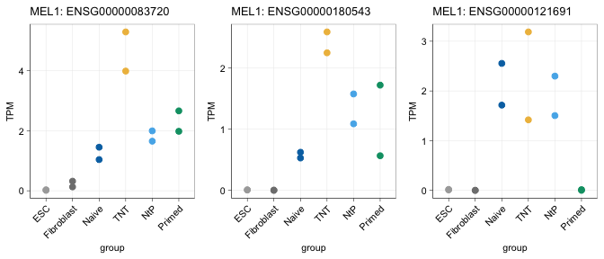

RNA-seq re-analysis: TNT uncorrected gene examples
================
Sam Buckberry
2024-07-09

``` r
source("project-functions.R")

## Sample metadata
sample_dat <- data.table::fread("polyA_RNAseq_sample_table.tsv")

## RNA-seq counts data
count_dat <- read.table("mel1_rmdup.featureCounts.gz", header = TRUE)

colnames(count_dat) <- colnames(count_dat) %>%
    str_remove("X.data.tki_bodl.sammyb.") %>%
    str_remove("_Aligned.markdup.bam")

## Subset just to counts
dat <- count_dat[ ,colnames(count_dat) %in% sample_dat$Library]
rownames(dat) <- count_dat$Geneid

# Check library ID's match and order accordingly
stopifnot(all(colnames(dat) %in% sample_dat$Library))
sample_dat <- sample_dat[match(colnames(dat), sample_dat$Library), ]
stopifnot(all(sample_dat$Library == colnames(dat)))

# Calculate TPM
countToTpm <- function(counts, effLen){
    rate <- log(counts) - log(effLen)
    denom <- log(sum(exp(rate)))
    exp(rate - denom + log(1e6))
}

tpm <- countToTpm(counts = dat, effLen = count_dat$Length)

gene_gr <- import("gencode.v27.primary_assembly.annotation.gtf.gz", format = "gtf")

gene_gr$ensembl_gene_id <- sub("\\..*$", "", gene_gr$gene_id)

## Clean up labels
sample_dat$Group[sample_dat$Group == "N2P"] <- "NtP"

reprog_pal <- c(Primed="#009E73", Naive="#0072B2",
                TNT="#EEBC4C", NtP="#55B3EA", ESC="darkgrey")

plot_gene <- function(gene_id){

    ensg_select <- gene_gr$gene_id[gene_gr$ensembl_gene_id %in% gene_id] %>% unique()

    tpm_select <- tpm[rownames(tpm) %in% ensg_select, ]
    tpm_select$ENSG_id <- rownames(tpm_select)

    tpm_select <- reshape2::melt(tpm_select)
    ind <- match(tpm_select$variable, sample_dat$Library)
    tpm_select$group <- sample_dat$Group[ind]

    ind2 <- match(tpm_select$ENSG_id, gene_gr$gene_id)
    tpm_select$Gene <- gene_gr$ensembl_gene_id[ind2]

    tpm_select$group <- factor(tpm_select$group, levels=c("ESC", "Fibroblast",
                                                          "Naive", "TNT", "NtP",
                                                          "Primed"))

    gg_gene_select <- ggplot(tpm_select, aes(x = group, y = value, colour=group)) +
        #stat_summary(fun = mean, geom = "bar", width = 0.2, alpha=0.5) +
        geom_point(size=2) +
        scale_colour_manual(values = reprog_pal) +
        #geom_col(width = 0.1) +
        ggtitle(str_c("MEL1: ", gene_id)) +
        ylab("TPM") +
        sams_pub_theme()

    gg_gene_select

}

ensg_select <- gene_gr$ensembl_gene_id[gene_gr$gene_name %in%
                                   c("CAT", "OXCT1", "TSPYL5")] %>% unique()

pdf("tnt-not-corrected-3-gene-plot.pdf", height = 2, width = 5)
cowplot::plot_grid(plotlist = lapply(ensg_select, plot_gene),
                   nrow = 1)
dev.off()
```

    ## quartz_off_screen 
    ##                 2

``` r
cowplot::plot_grid(plotlist = lapply(ensg_select, plot_gene),
                   nrow = 1)
```

    ## Using ENSG_id as id variables
    ## Using ENSG_id as id variables
    ## Using ENSG_id as id variables

<!-- -->

### Session info

``` r
sessionInfo()
```

    ## R version 4.4.0 (2024-04-24)
    ## Platform: aarch64-apple-darwin20
    ## Running under: macOS Sonoma 14.5
    ## 
    ## Matrix products: default
    ## BLAS:   /Library/Frameworks/R.framework/Versions/4.4-arm64/Resources/lib/libRblas.0.dylib 
    ## LAPACK: /Library/Frameworks/R.framework/Versions/4.4-arm64/Resources/lib/libRlapack.dylib;  LAPACK version 3.12.0
    ## 
    ## locale:
    ## [1] en_US.UTF-8/en_US.UTF-8/en_US.UTF-8/C/en_US.UTF-8/en_US.UTF-8
    ## 
    ## time zone: Australia/Perth
    ## tzcode source: internal
    ## 
    ## attached base packages:
    ## [1] grid      stats4    stats     graphics  grDevices utils     datasets 
    ## [8] methods   base     
    ## 
    ## other attached packages:
    ##  [1] forcats_1.0.0          readxl_1.4.3           data.table_1.15.4     
    ##  [4] dplyr_1.1.4            plotly_4.10.4          rtracklayer_1.64.0    
    ##  [7] Gviz_1.48.0            Rsamtools_2.20.0       Biostrings_2.72.1     
    ## [10] XVector_0.44.0         cowplot_1.1.3          gridExtra_2.3         
    ## [13] reshape2_1.4.4         stringr_1.5.1          GenomicFeatures_1.56.0
    ## [16] AnnotationDbi_1.66.0   Biobase_2.64.0         GenomicRanges_1.56.0  
    ## [19] GenomeInfoDb_1.40.0    IRanges_2.38.0         S4Vectors_0.42.0      
    ## [22] BiocGenerics_0.50.0    ggplot2_3.5.1          magrittr_2.0.3        
    ## [25] edgeR_4.2.0            limma_3.60.2          
    ## 
    ## loaded via a namespace (and not attached):
    ##   [1] RColorBrewer_1.1-3          rstudioapi_0.16.0          
    ##   [3] jsonlite_1.8.8              farver_2.1.2               
    ##   [5] rmarkdown_2.27              BiocIO_1.14.0              
    ##   [7] zlibbioc_1.50.0             vctrs_0.6.5                
    ##   [9] memoise_2.0.1               RCurl_1.98-1.14            
    ##  [11] base64enc_0.1-3             htmltools_0.5.8.1          
    ##  [13] S4Arrays_1.4.1              progress_1.2.3             
    ##  [15] curl_5.2.1                  cellranger_1.1.0           
    ##  [17] SparseArray_1.4.8           Formula_1.2-5              
    ##  [19] htmlwidgets_1.6.4           plyr_1.8.9                 
    ##  [21] httr2_1.0.1                 cachem_1.1.0               
    ##  [23] GenomicAlignments_1.40.0    lifecycle_1.0.4            
    ##  [25] pkgconfig_2.0.3             Matrix_1.7-0               
    ##  [27] R6_2.5.1                    fastmap_1.2.0              
    ##  [29] GenomeInfoDbData_1.2.12     MatrixGenerics_1.16.0      
    ##  [31] digest_0.6.35               colorspace_2.1-0           
    ##  [33] Hmisc_5.1-3                 RSQLite_2.3.7              
    ##  [35] labeling_0.4.3              filelock_1.0.3             
    ##  [37] fansi_1.0.6                 httr_1.4.7                 
    ##  [39] abind_1.4-5                 compiler_4.4.0             
    ##  [41] bit64_4.0.5                 withr_3.0.0                
    ##  [43] htmlTable_2.4.2             backports_1.5.0            
    ##  [45] BiocParallel_1.38.0         DBI_1.2.3                  
    ##  [47] highr_0.11                  biomaRt_2.60.0             
    ##  [49] rappdirs_0.3.3              DelayedArray_0.30.1        
    ##  [51] rjson_0.2.21                tools_4.4.0                
    ##  [53] foreign_0.8-86              nnet_7.3-19                
    ##  [55] glue_1.7.0                  restfulr_0.0.15            
    ##  [57] checkmate_2.3.1             cluster_2.1.6              
    ##  [59] generics_0.1.3              gtable_0.3.5               
    ##  [61] BSgenome_1.72.0             tidyr_1.3.1                
    ##  [63] ensembldb_2.28.0            hms_1.1.3                  
    ##  [65] xml2_1.3.6                  utf8_1.2.4                 
    ##  [67] pillar_1.9.0                BiocFileCache_2.12.0       
    ##  [69] lattice_0.22-6              deldir_2.0-4               
    ##  [71] bit_4.0.5                   biovizBase_1.52.0          
    ##  [73] tidyselect_1.2.1            locfit_1.5-9.9             
    ##  [75] knitr_1.47                  ProtGenerics_1.36.0        
    ##  [77] SummarizedExperiment_1.34.0 xfun_0.44                  
    ##  [79] statmod_1.5.0               matrixStats_1.3.0          
    ##  [81] stringi_1.8.4               UCSC.utils_1.0.0           
    ##  [83] lazyeval_0.2.2              yaml_2.3.8                 
    ##  [85] evaluate_0.23               codetools_0.2-20           
    ##  [87] interp_1.1-6                tibble_3.2.1               
    ##  [89] cli_3.6.2                   rpart_4.1.23               
    ##  [91] munsell_0.5.1               dichromat_2.0-0.1          
    ##  [93] Rcpp_1.0.12                 dbplyr_2.5.0               
    ##  [95] png_0.1-8                   XML_3.99-0.16.1            
    ##  [97] parallel_4.4.0              blob_1.2.4                 
    ##  [99] prettyunits_1.2.0           latticeExtra_0.6-30        
    ## [101] jpeg_0.1-10                 AnnotationFilter_1.28.0    
    ## [103] bitops_1.0-7                viridisLite_0.4.2          
    ## [105] VariantAnnotation_1.50.0    scales_1.3.0               
    ## [107] purrr_1.0.2                 crayon_1.5.2               
    ## [109] rlang_1.1.4                 KEGGREST_1.44.0
